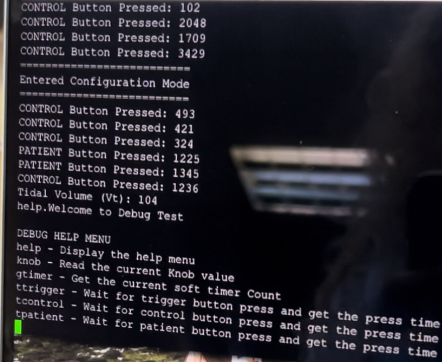

# STM32-Ventilator-RTOS
## Introduction
STM32F411 RTOS multithread system for controlling the volume, rate and flow for a ventilator.

Use Blackpill STM connected through serial to access the ventilator menu for settings. This project makes use of the STM32CubeIDE for comilation. 
The user enters the settings mode with a long press to enter the ventilator setting and then exit setting mode. 
The second button is used to connect/disconnect the 'patient' and only enables if settings have been entered.

## Simulation
This image shows the FSM modelled version that steps through each setting. The patient has to be disconnected to start the settings mode and all settings must be set and the mode exited to connect the patient and start pumping air. The airflow is indicated with a flashing LED.

## Implementation
The STM32 is connected with the following pinout:

The device is connected with the serial debugger to enter the settings mode and toggles the settings with an on screen menu and help functions to request the potentiometers current value and which setting is currently engaged. This can be set to show on a secondary LCD screen for better usability.
The device shows the airflow pumping at the same rate as the flow setting and can be validated on an oscilloscope. The red LED indicates if a patient is connected or not.

 

Solarized dark             |  Solarized Ocean
:-------------------------:|:-------------------------:
  |  

## Guidelines

Assumptions
1. For our purposes the screen of the AC Ventilator is represented by a text-based terminal.
2. All parameter adjustments (RR, VT, Qmax) are conducted by means of a rotary knob
(potentiometer) with fixed limits.
3. One button:
a. used to activate/deactivate the ventilation process.
b. the same button is used to cycle between the various parameters.
c. The duration of the button press is used to enter the settings mode of the AC
ventilator.
4. A second button is used to trigger a spontaneous breath. A trigger sensitivity is required. The
button must be depressed for more than 1 sec to trigger a spontaneous breath.
5. An output LED is used to indicate the tidal volume (VT) per breath.
6. Another output LED is used to indicate the constant flow rate (Qmax).

Task:
Develop an FSM of an AC ventilator’s operation. Assume that the settings mode is entered into by depressing an input button for a period between 1-3 seconds.
Further, assume that all settings will be cycled through from:
• Tidal volume (VT)àassume an input range between 500-750 mL/breath for adults.
o Tidalvolumeisassumedtoincreaselinearintheinspiratoryphase,whiledecreasing
exponentially in the expiratory phase.
• Respiratory rate (RR)àassume an input range between 12-20.
• Flow rate (Qmax)àassume an input range between 60-120 L/min

Once moving from the current setting to the next, the input from the knob will be stored.
The AC ventilator is turned ON/OFF by a single press of the user button. Outputs to the ventilator is only active in the ON state of the machine.
A second button is required to act as a trigger for spontaneous breathing by a patient. Once a trigger is detected, the AC ventilator should output the set tidal volume at the same flow rate. If the button is not used as a trigger, the ventilator should just continue with its mode of operation. Incorporate a trigger sensitivity as mentioned earlier.
All set points, settings adjustments, and the current state of the machine and outputs should be displayed in the scope.
